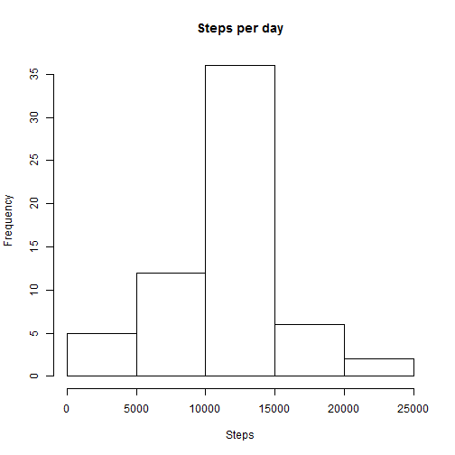

# Reproducible Research
##Assignment 1

This document contains R code, R output and graphical output. The goal is to answer the questions of the 1st project of the Reproducible Research Course.

This first section unzips the data (after it has been [downloaded][1] and placed in the workin directory) and loads from the library the packages that are required in order to complete the analysis.

[1]:https://d396qusza40orc.cloudfront.net/repdata%2Fdata%2Factivity.zip/ "downloaded"


```r
library(dplyr)
```

```
## 
## Attaching package: 'dplyr'
## 
## The following object is masked from 'package:stats':
## 
##     filter
## 
## The following objects are masked from 'package:base':
## 
##     intersect, setdiff, setequal, union
```

```r
library(lattice)
list.files()
```

```
## [1] "activity.csv"              "PA1_Template.Rmd"         
## [3] "Project1.Rmd"              "repdata_data_activity.zip"
## [5] "win-library"
```

```r
unzip("C:/Users/Miri/Documents/R/repdata_data_activity.zip")
data <- read.csv('activity.csv')
```


##What is the mean total number of steps taken per day    
  
  
  
Here are presented all the steps needed to compute the mean and the median day by day
  
  
  

```r
daily_steps <- aggregate(data[,1],by=list((data[,2])),sum,na.rm=TRUE)
names <- c("day","Steps")
names(daily_steps)<-names
daily_steps<- filter(daily_steps,Steps!=0)
mean(daily_steps[,2],na.rm=TRUE)
```

```
## [1] 10766.19
```

```r
median(daily_steps[,2],na.rm=TRUE)
```

```
## [1] 10765
```


This histogram shows graphically the distribution


```r
hist(daily_steps[,2], main='Steps per day', xlab='Steps')
```

 


##What is the average daily activity pattern?

Here the data is grouped by intervals across days. The interval that has on average the highest number of steps is reported


```r
interval1 <- group_by(data,interval)
interval_mean <- summarise(interval1,mean(steps,na.rm=TRUE))
n <-c("interval", "steps")
names(interval_mean) <- n
interval_mean <- as.data.frame(interval_mean)
which.max(interval_mean[,2])
```

```
## [1] 104
```


Plot of the number of steps per interval across days


```r
plot(interval_mean[,1],interval_mean[,2],type="l",main="Mean steps across intervals",xlab="Interval",ylab="Mean")
```

 


##Inputing missing values
In the previous sections the NA values were ignored or eliminated.
In this section, missing values are replaced by the mean for every interval.
Replacing does not change the mean/median values by day. As can be seen the values are identical to the values in the first section. 


```r
sum(is.na(data[,1]))
```

```
## [1] 2304
```

```r
data_clean <- data
data_clean[is.na(data_clean)]<- interval_mean[,2]
sum(is.na(data_clean[,1]))
```

```
## [1] 0
```

```r
daily_steps1 <- aggregate(data_clean[,1],by=list((data_clean[,2])),sum)
names <- c("day","Steps")
names(daily_steps1)<-names

mean(daily_steps1[,2],)
```

```
## [1] 10766.19
```

```r
median(daily_steps1[,2],)
```

```
## [1] 10766.19
```


The histogram is also the same, nothing has changed.


```r
hist(daily_steps1[,2], main='Steps per day', xlab='Steps')
```

 


##Are there differences in patterns between weekdays and weekends?
The data are grouped by intervals and days (two levels showing whether the days is weekday or weekend). 


```r
data_clean[,2]<- as.character(data_clean[,2])
week_days <-strptime(data_clean[,2],format="%Y-%m-%d")
week_days <- weekdays(week_days)
data_clean[,2] <- week_days
data_clean2 <- mutate(data_clean,date=ifelse(date=="Saturday"|date=="Sunday","weekend","weekday"))
interval2 <- group_by(data_clean2,interval,date)
interval_mean2 <- summarise(interval2,sum(steps))
interval_mean2 <- as.data.frame(interval_mean2)
```


The two histograms below show the difference in pattern for the two categories.


```r
plot <- xyplot(interval_mean2[,3]~interval_mean2[,1]|interval_mean2[,2],type='l',layout=c(1,2),main="Steps conditioned on weekdays or weekends",xlab="interval",ylab="frequency")
print(plot)
```

 

